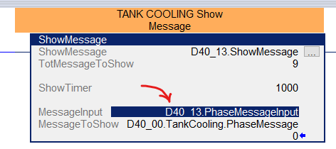

## SCOPO

Automazione creazione files .ENG per HMI partendo da `.L5X` del progetto PLC RSLogix5000

## PREREQUISITI

- `CFG_INI.ini` da supervisione
- `****.L5X`        da PLC

La lettura del file .L5X è basata sul pacchetto [l5x](https://github.com/jvalenzuela/l5x)
testato sulla [Release_v1.5](Release_v1.5)

[README_l5x](https://github.com/jvalenzuela/l5x#readme)
### Creare il virtual enviroment
```ps
	python -m venv venv
```
### Attivare il virtual enviroment
```ps
	.\venv\Scripts\Activate.ps1
```
### Installare le librerie necessarie
```ps
	pip install -r requirements.txt
```

### FUNZIONI
----------------------
Fare riferimento al file di [HELP](RES/help.ini) o lanciare il comando senza switch

1 - IOMESSAGE

Prende la lista delle macchine esterne dal file `CFG_INI.ini` (da recuperare in supervisione)
e il file .L5X esportato dal plc e crea un file IOMESSAGE.ENG per ogni macchina

2 - NOMI CICLI

Crea file con i nomi dei cicli (un file per i cicli di produzione e uno per i cicli Sterilizzazione/Sanificazione)

3 - PHASES

Crea un file .ENG per ogni ciclo da esportare.
Il file viene generato con la seguente formattazione:

```INI
[CYCL_FIL_BaseRinsing_Phase]=Program:FILLER.D40_00.BaseRinsing.Phase
10= V; Machine Emptying
20= V; Cleaning
30= V; End Cycle

[CYCL_FIL_BaseRinsing_MSG]=Program:FILLER.D40_00.BaseRinsing.CycleMsg
1= V; - Waiting conditions ready to start cycle
2= V; - Cycle started
3= V; - Cycle running
4= V; - Cycle held
5= V; - Cycle failed
6= V; - Cycle done
7= V; - Waiting "Blow molder empty" signal active from ABF
8= V; - Waiting "Blow molder empty" signal active from SIPA
9= V; - Waiting "Blow molder empty" signal active from KHS
10= V; - Waiting "Sterile water ready" signal from Unitherm


[CYCL_FIL_BaseRinsing_PhaseMSG]=Program:FILLER.D40_00.BaseRinsing.PhaseMessage
1= V;Alarm condition active
2= V;Push machine start
3= V;Waiting Filler in rotation
4= V;Waiting for all active production cycles to end
5= V;Waiting Filler internal bottle counter at zero (Filler empty)
6= V;Valve 261VPW59 open
7= V;Valve CA1VPW06 open
8= V;Valve CA1VPB01 open
```

### DEBUG
-------

Per lanciare eventalmente il debug editare il file [launch.json](.vscode/launch.json) andando, per esempio, a modificare l'argomento con lo switch che interessa debuggare

### NOTE
-----

La funzione `CycleDesc` ha un parametro che indica il nome della struttura PhaseMsgInput e lo si trova nel plc guardando qui:

